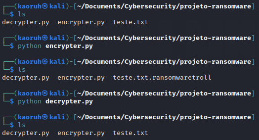

# Criando um Ransomware com Python

### Ferramentas

- Kali Linux
- Phyton 3

### Criando arquivos

- Criar um arquivo txt com nano: ```nano teste.txt```
- Escrever um texto qualquer, control O, enter, control X.
- Criar o arquivo encrypter.py con nano: ``` nano encrypter.py ```
- Importar os e pyaes. Escrever a lógica.
- Criar o arquivo decrypter.py con nano: ``` nano decrypter.py ```
- Importar os e pyaes. Escrever a lógica.
- Rodar o encrypter: ``` phyton encrypter.py ```
- Verificar arquivos: ```ls```
- Repetir com decrypter.py

### Resutados


